# Procesverslag
Markdown is een simpele manier om HTML te schrijven.  
Markdown cheat cheet: [Hulp bij het schrijven van Markdown](https://github.com/adam-p/markdown-here/wiki/Markdown-Cheatsheet).

Nb. De standaardstructuur en de spartaanse opmaak van de README.md zijn helemaal prima. Het gaat om de inhoud van je procesverslag. Besteedt de tijd voor pracht en praal aan je website.

Nb. Door *open* toe te voegen aan een *details* element kun je deze standaard open zetten. Fijn om dat steeds voor de relevante stuk(ken) te doen.
 

## Jij

  
uitwerken voor kick-off werkgroep

  ### Auteur:
  Loeta Aarden 

  #### Je startniveau:
  blauw met een beetje rood (kies uit zwart, rood óf blauw)

  #### Je focus:
  surface plane (kies uit responsive óf surface plane)
 

## Je website

  
uitwerken voor kick-off werkgroep

  ### Je opdracht:
  https://www.dopper.com/

  #### Screenshot(s) van de eerste pagina (small screen): 
  hier de naam van de pagina  
  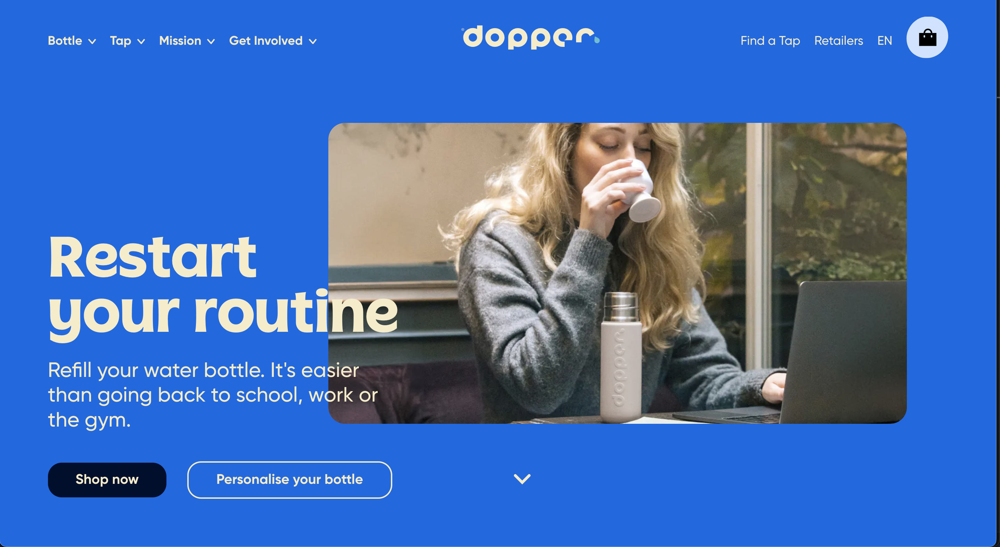

  #### Screenshot(s) van de tweede pagina (small screen):
  hier de naam van de pagina  
  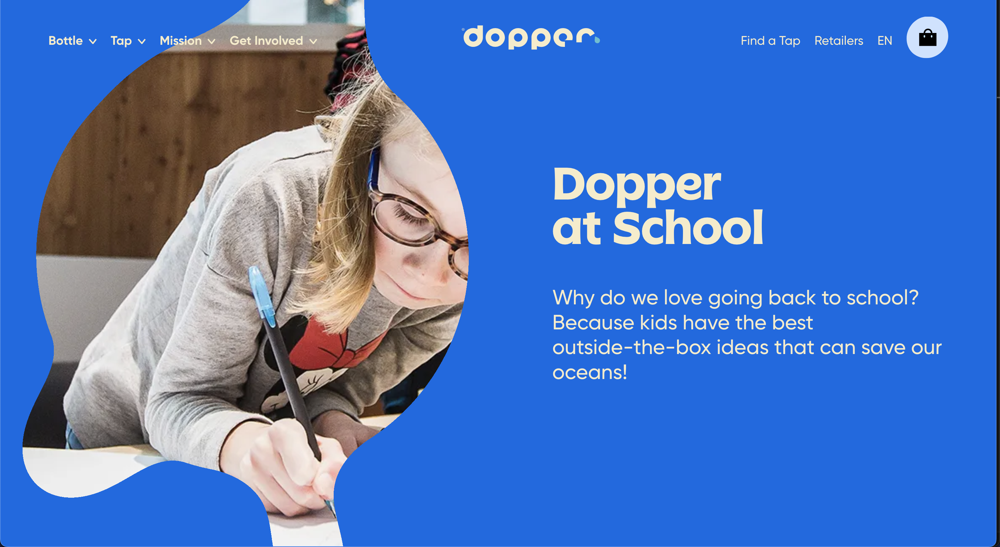
 

## Toegankelijkheidstest 1/2 (week 1)

  
uitwerken na test in 2e werkgroep

  ### Bevindingen
  Lijst met je bevindingen die in de test naar voren kwamen:
  Mijn website:
  - de navigatie spreekt de voiceover uit als "bottle, image, tap, image, ect...." dus elke keer blijft hij de "image" herhalen aangezien de kleine dropdown hebben ze als image neergezet waardoor dat wordt uitgesproken.
  - ook komen er dingen omhoog die niet te zien zijnn om de pagina maar wel allemaal gezegd worden omdat ze in het menu zitten als je erop klikt. Hierdoor wordt het wel heel vaag en is het niet te volgen.

a11y test: 

content: 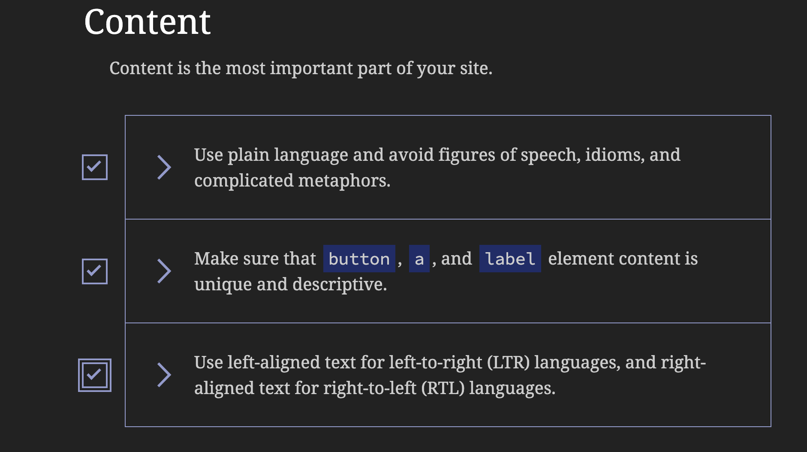
De dopper website maakt wel gebruik van duidelijk leesbare tekst. Ook zijn de buttons ect duidelijk omdat ze vaak zeggen "read our (en dan waarover je meer kan lezen)" waardoor je wel duidelijk weet waar je meer over gaat lezen/waar je naar toe gaat. En de tekst is ook fijn leesbaar gepositioneerd.

global code: 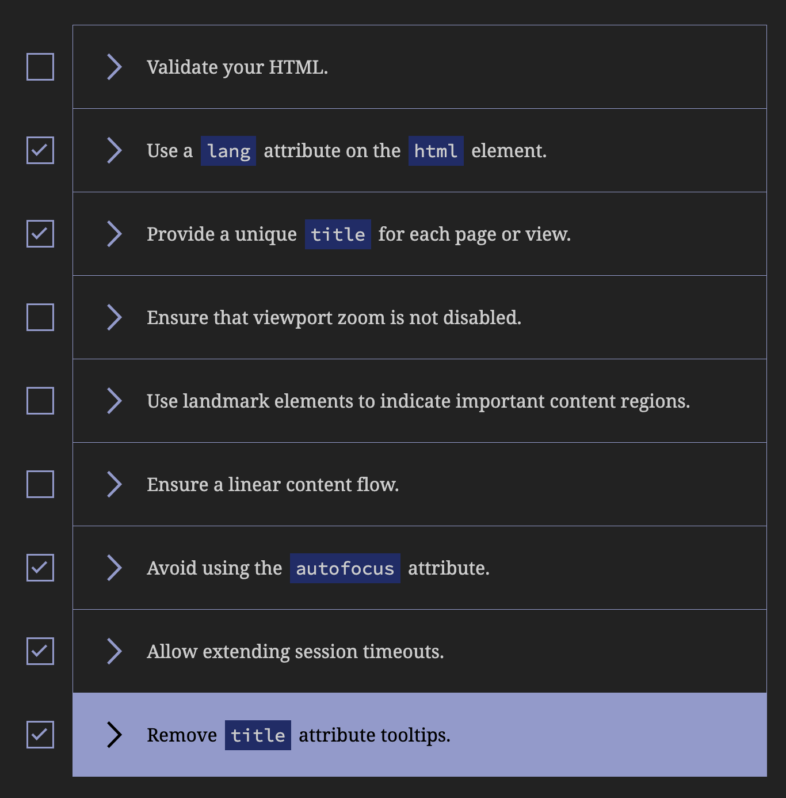
De html code van de heeft 377 errors. Ook zit er css en javascript in de html.

keyboard: 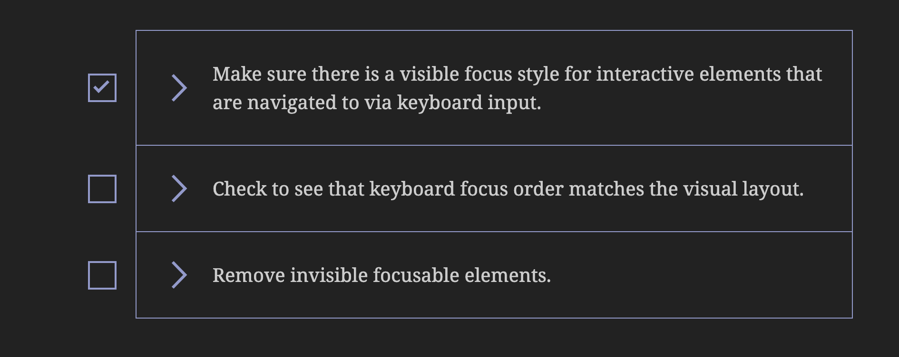 
de site is wel goed door te gaan met keyboard. Aan het begin ga je wel door een stukje waar je niet kan zien waar je bent en de state is niet gestyled.

Images:  
De images hebben vaak wel goede alt teksten maar af en toe is het ook gewoon het woord "dopper". De site heeft geen graphs, charts or maps. 

Headings: 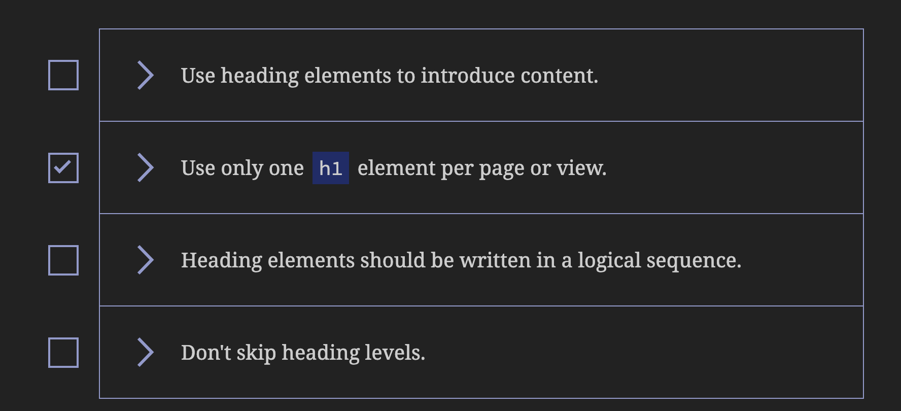 
Op de site is er 1 duidelijk h1. Maar de rest van de headings zijn niet duidelij en kloppen allemaal niet.

Controls: 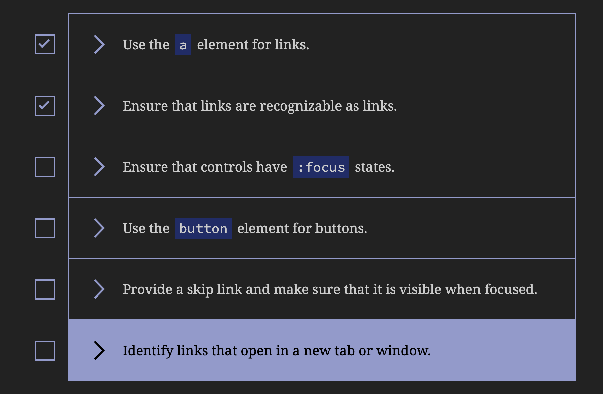 
de a tags loppen vaak wel maar af en toe zit er een a tag en dan een button tag erover heen.

forms: 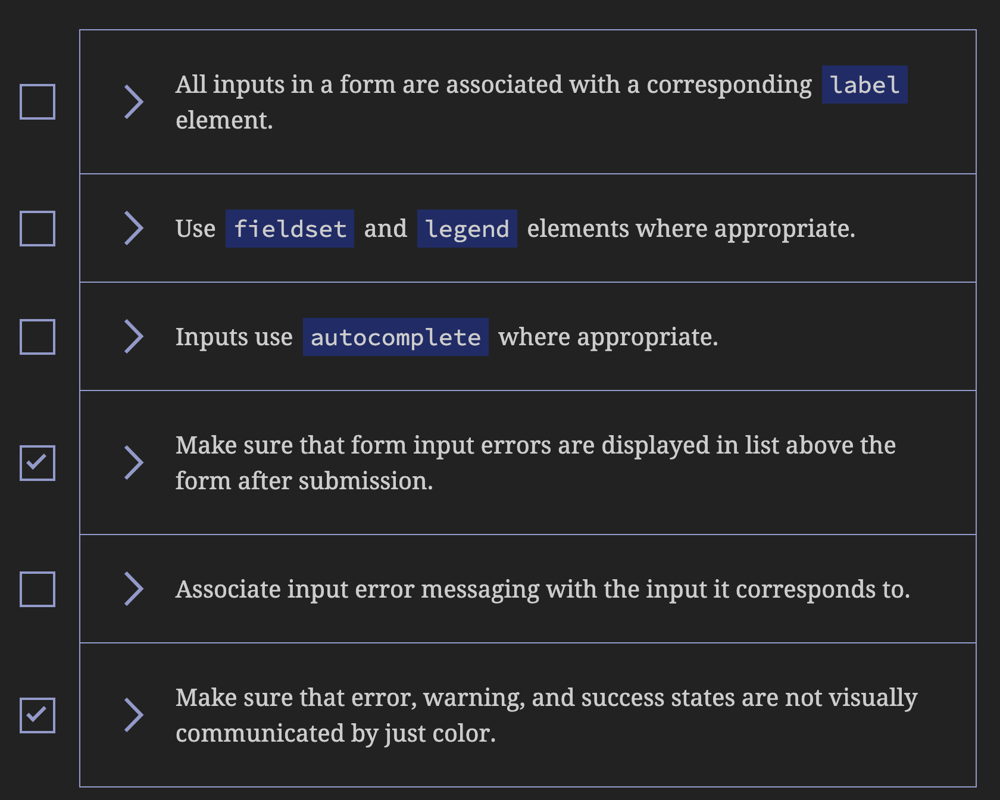 
de form geeft wel een error message

Appearance: 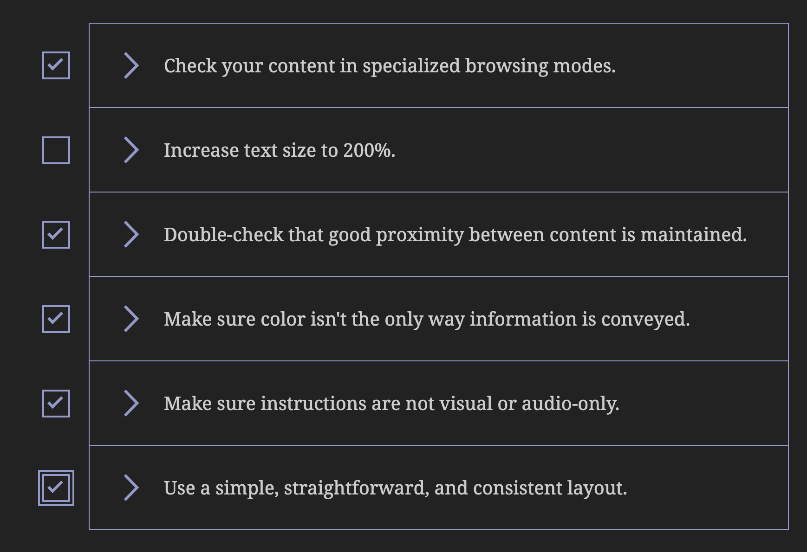 
alles is wel duidelijk en de increase 200% is ook wel duidelijk maar er is 1 foto die niet werkt als die ingezoomd is.

Animation: 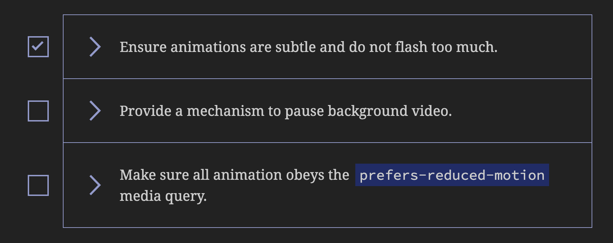 
De animation zijn niet te overwhelming. Er is geen video of iets op de website. Er is ook geen media querry voor reduced motion te vinden.

Color Contrast: 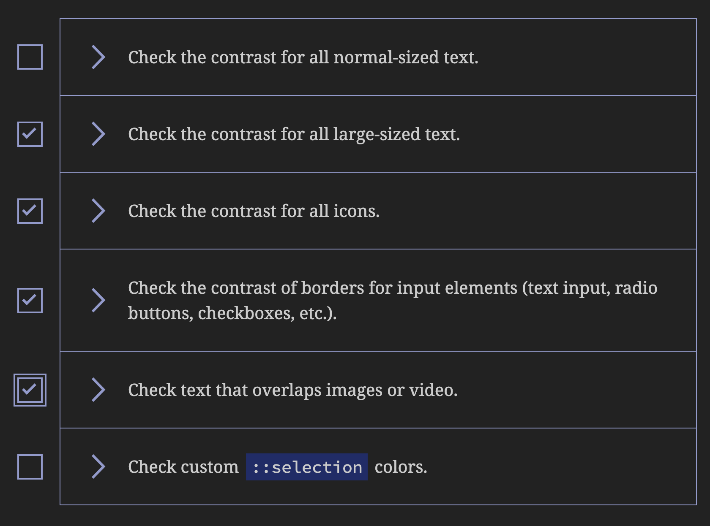 
de contrast is overal oke behalve op 1 stukje normale intro tekst.

Mobile and touch: 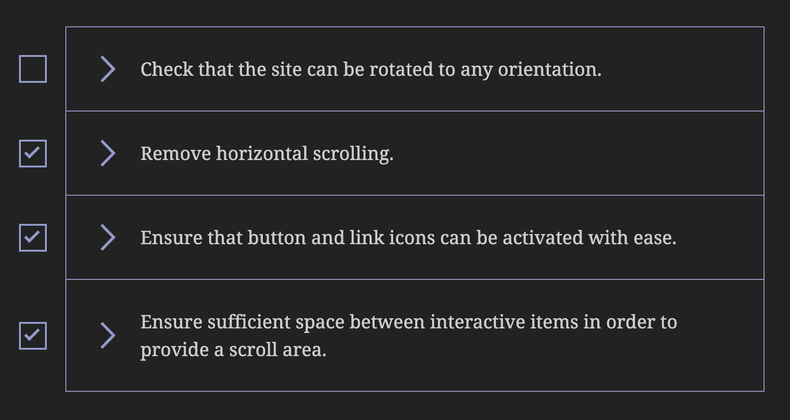 
alles werkt goed op mobile versie behalve dat als je een mobiel horizontaal draait zijn de images niet groot gen oeg dus zit er wit ruimte links en rechts.

  andere websites:
  - bij andere websites die ik heb gechecked heb ik gemerkt dat er vaak bijvoorbeeld een foto met een alt tekst staat en dan nog een keer de titel wordt uitgesproken.
  - ook is bij veel websites die volgorde hoe het wordt verteld totaal niet duidelijk.

## Breakdownschets (week 1)

  
uitwerken na afloop 3e werkgroep

  ### de hele pagina: 
  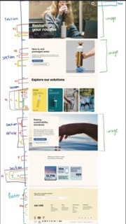

## Voortgang 1 (week 2)

  
uitwerken voor 1e voortgang

  ### Stand van zaken
  hier dit ging goed & dit was lastig (neem ook screenshots op van delen van je website en code)

  ### Agenda voor meeting
  samen met je groepje opstellen

  | student 1      | student 2          | student 3    | student 4        |
  | ---            | ---                | ---          | ---              |
  | dit bespreken  | en dit             | en ik dit    | en dan ik dat    |
  | en dat ook nog | dit als er tijd is | nog een punt | dit wil ik zeker |
  | of een list in | moet ik heel de nav| kan ik het   | is dit een h2?   | 
  de footer voor de| uitwerken          | vertalen |    
  linkjes mag/hanig is |                |van de site een als |
                                        | een van die special |
                                        |dingen gebruiken voor|
                                        |surface plane          

  ### Verslag van meeting
  hier na afloop snel de uitkomsten van de meeting vastleggen

  - 1: de list in de footer mag gewoon en werkt. 
  - 2: ja met een hamburger menu
  - 3: vertalen van de site is niet perse handig omdat dat dan eigenlijk gewoon een nieuwe pagina is maar andere tekst.
  - 4: ja

## Voortgang 2 (week 3)

  
uitwerken voor 2e voortgang

  ### Stand van zaken
  hier dit ging goed & dit was lastig (neem ook screenshots op van delen van je website en code)

  ### Agenda voor meeting
  samen met je groepje opstellen

  | student 1      | student 2          | student 3    | student 4        |
  | ---            | ---                | ---          | ---              |
  | dit bespreken  | en dit             | en ik dit    | en dan ik dat    |
  | en dat ook nog | dit als er tijd is | nog een punt | dit wil ik zeker |
  | ...            | ...                | ...          | ...              |
  | wat mag voor   | op mijn 2de pagina | mijn tekst is| hoe kan ik de submit
  surface plane,   | had ik een class   | meer bold op | button een pijltje inzetten?
  zijn de animaties| gezet maar de styling| mijn site
  die in de site al| wouw niet op de site | in tegestelling
  zitten goed? zoals| doordat het die   | tot die van 
  de hover? terwijl| eerste site effect | dopper
  het op mobiel zit?| hoe kan ik dit fixen?

  ### Verslag van meeting
  hier na afloop snel de uitkomsten van de meeting vastleggen

  - 1: de hamburger menu is een surface plane, hover, dark mode, header als je omhoog scrolled ook. 
  - 2: voor de 2de styling kan ik de main een class geven en dan de css selectors gebruiken
  - 3: dat het iets meer bold is kan je kijken of het nog met bold kan veranderd worden maar een klien beetje verschil is niet heel erg.
  - 4: Hiervoor heb ik een linkje gekrijgen hoe ik deze in de submit button kan zetten

## Toegankelijkheidstest 2/2 (week 4)

  
uitwerken na test in 9e werkgroep

  ### Bevindingen
  Lijst met je bevindingen die in de test naar voren kwamen (geef ook aan wat er verbeterd is):

a11y test: 

content: 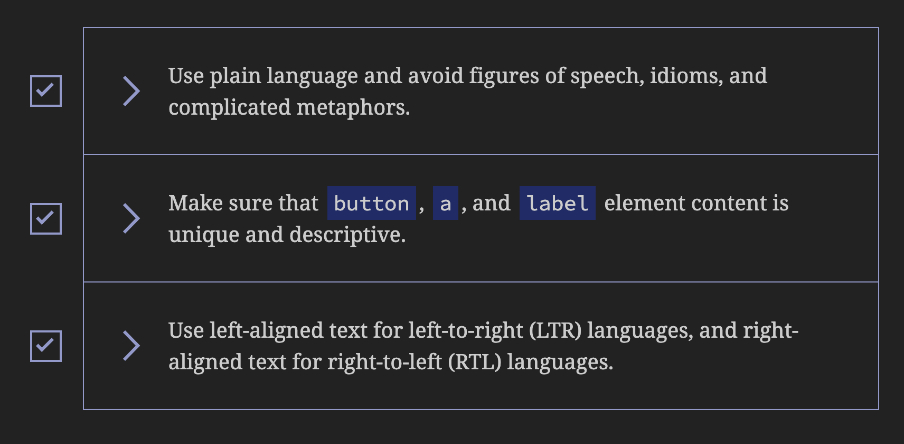

global code: 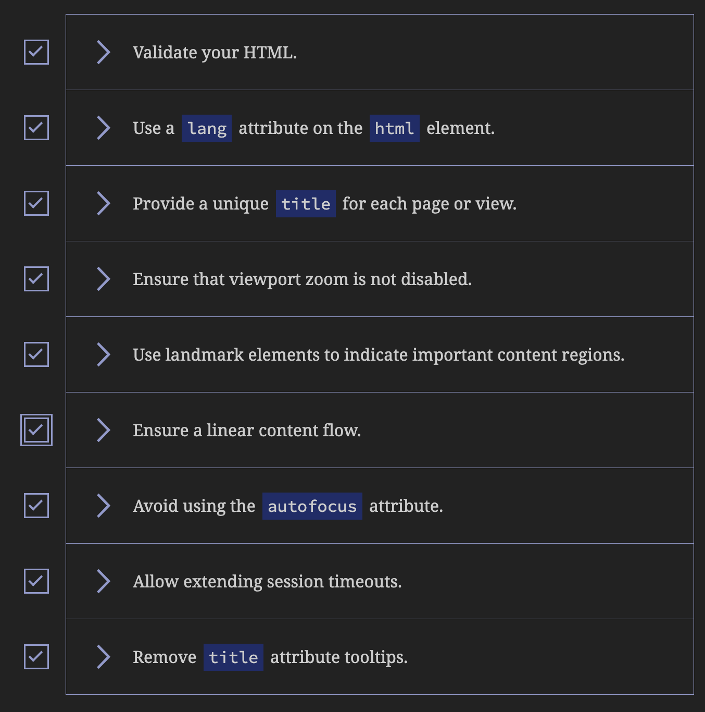

keyboard:  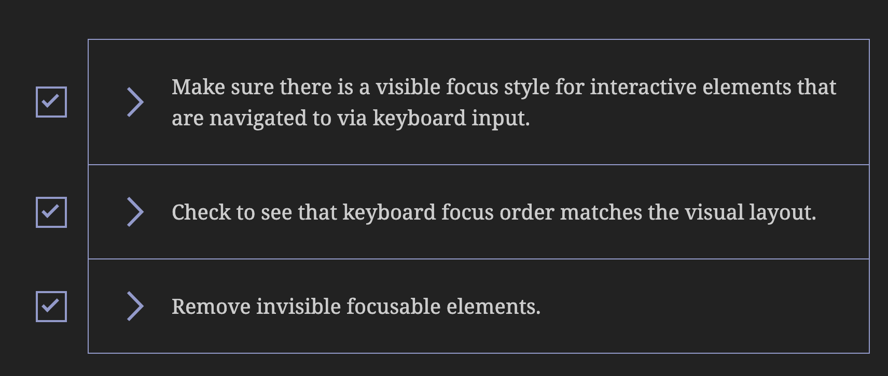

Images: 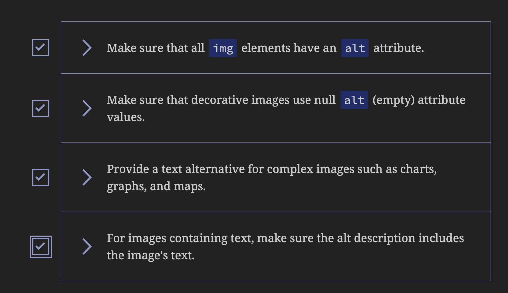

Headings: 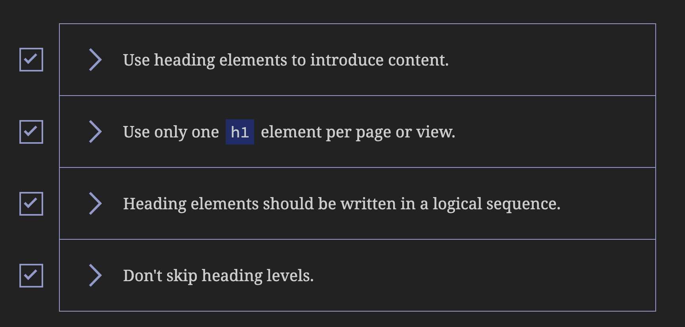

Lists: 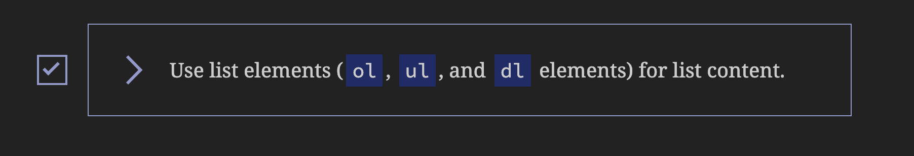

Controls: 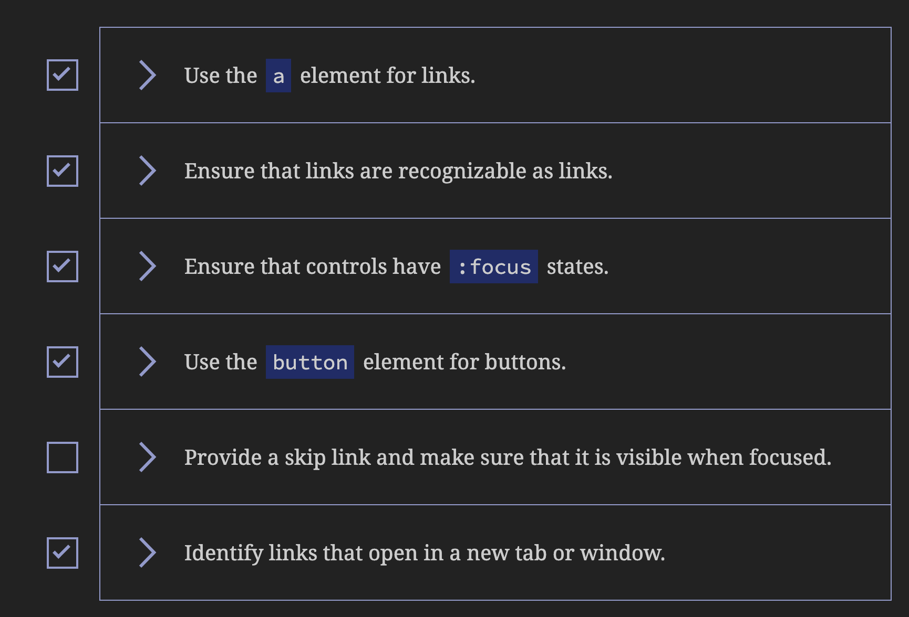

forms: 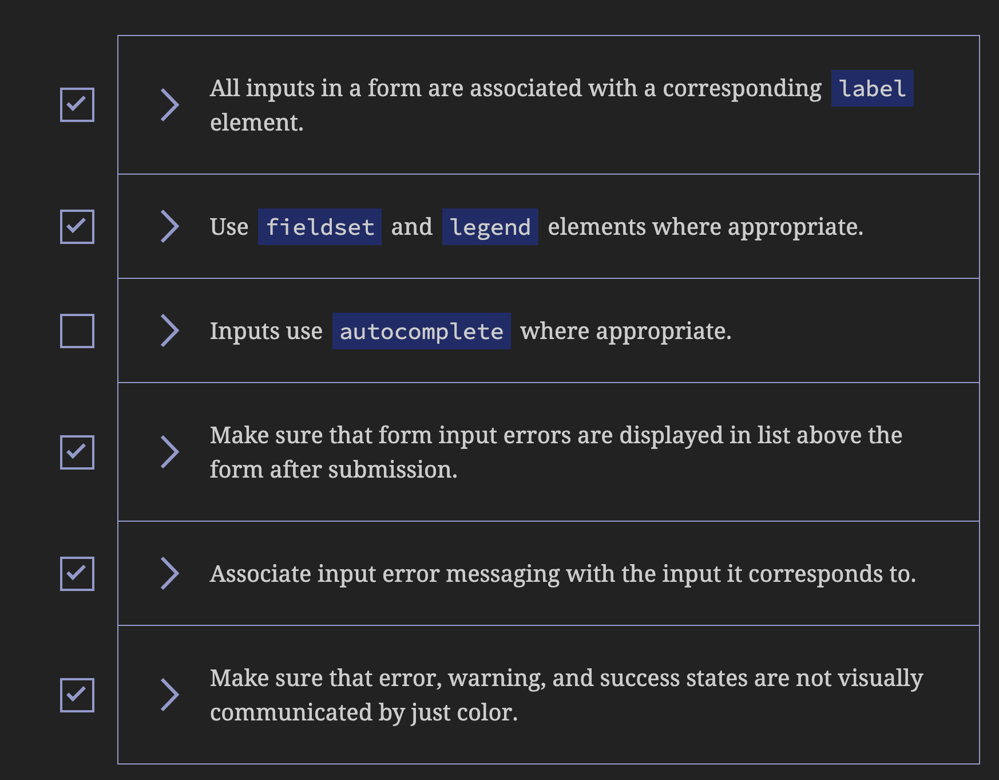

Appearance: 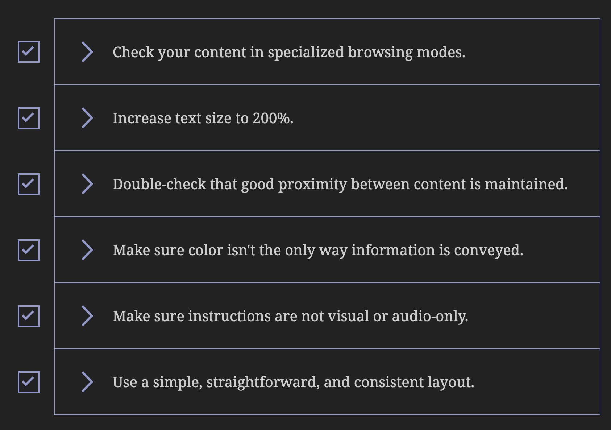

Animation: 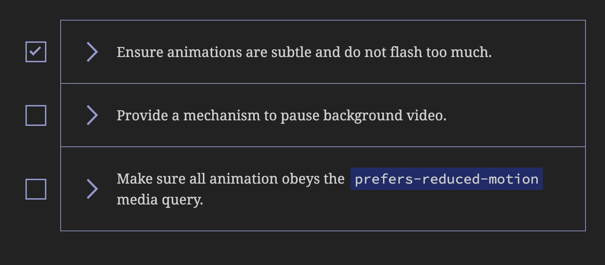
Ik heb geen video dus die is voor mij niet van toepassing

Color Contrast: 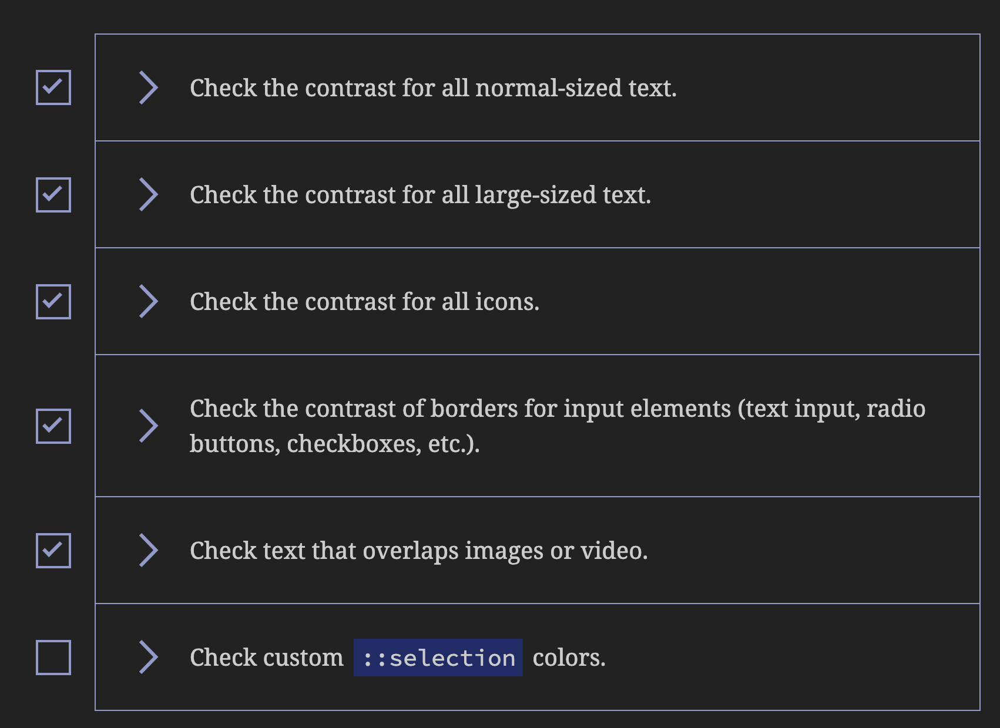

Mobile and touch: 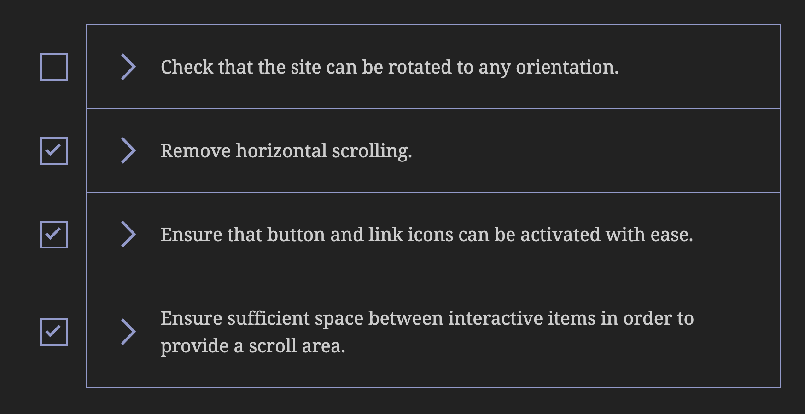

## Voortgang 3 (week 4)

  
uitwerken voor 3e voortgang

  ### Stand van zaken
  hier dit ging goed & dit was lastig (neem ook screenshots op van delen van je website en code)

  ### Agenda voor meeting
  samen met je groepje opstellen

  | student 1      | student 2          | student 3    | student 4        |
  | ---            | ---                | ---          | ---              |
  | dit bespreken  | en dit             | en ik dit    | en dan ik dat    |
  | en dat ook nog | dit als er tijd is | nog een punt | dit wil ik zeker |
  | ...            | ...                | ...          | ...              |
1. mn menu knop werkt wel op 1 site maar niet op de andere?
2. ik krijg die carousel buttons niet te zien? 
3. bij de form heb i geen action maar dat geeft een error?s
4. zijn dit sections of divjes?

  ### Verslag van meeting
  hier na afloop snel de uitkomsten van de meeting vastleggen

  - mn javascript stond op een verkeerde plek (dit probeelm had ik ookal bij de vorige pagina maar had dit nog niet bij de 2de pagina gedaan)
  - 
  - voeg hier text in toe dat het terug gaat naar de pagina zodat er dan niks gebeurt.
  - dit zal ik een lijstje in het orginele lijstje maken.

## Eindgesprek (week 5)

  
uitwerken voor eindgesprek

  ### Je uitkomst - karakteristiek screenshots:
  

  ### Dit ging goed/Heb ik geleerd: 
  Korte omschrijving met plaatjes

  

  ### Dit was lastig/Is niet gelukt:
  Korte omschrijving met plaatjes

  

## Bronnenlijst

  
continu bijhouden terwijl je werkt

  Nb. Wees specifiek ('css-tricks' als bron is bijv. niet specifiek genoeg). 
  Nb. ChatGpT en andere AI horen er ook bij.
  Nb. Vermeld de bronnen ook in je code.

  1.  https://angel-rs.github.io/css-color-filter-generator/
  2. https://images.app.goo.gl/rNRYyNspaaYZukJHA
  3. 

